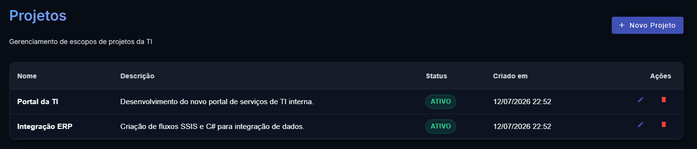
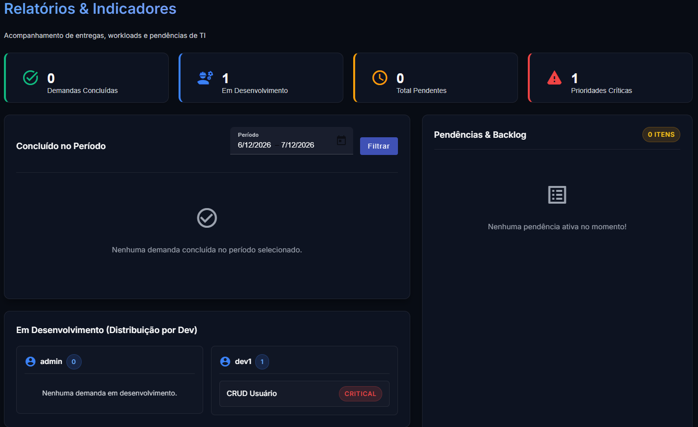

# Sistema de Gerenciamento de Demandas e Projetos — TI Interna

Sistema Full-Stack para controle e gestão de demandas, bugs, requisitos e timesheet da equipe de TI interna.

**Stack:** C# .NET 10 Web API · SQL Server · Entity Framework Core · Angular 22 · Angular Material · JWT

---

## 📸 Screenshots

### Demandas e Requisitos


### Projetos


### Relatórios


---

## 🚀 Funcionalidades Principais

| Módulo | Descrição |
|---|---|
| **Autenticação RBAC** | Login JWT com perfis: Administrador, Desenvolvedor e Colaborador |
| **Gestão de Projetos** | CRUD completo de projetos (restrito a Administradores) |
| **Gestão de Demandas** | Grid dinâmico com 5 filtros obrigatórios, busca por texto, paginação |
| **Prioridade / Status inline** | Alteração rápida diretamente na listagem por menus pop-up |
| **Timesheet** | Lançamento diário de horas por demanda com acumulado total |
| **Comentários** | Thread de discussão colaborativa por demanda |
| **Anexos** | Upload de evidências (prints, PDFs, Word) por demanda |
| **Log de Auditoria** | Timeline automática de todas as alterações (responsável, status, datas) |
| **Dashboard de Relatórios** | Demandas concluídas por período, carga por dev, alertas de prazo |

---

## 🔑 Credenciais de Teste (Seed automático)

O sistema migra o banco e semeia os dados na **primeira execução** (`dotnet run`).

### Usuários

| Perfil | Usuário | Senha | Permissões |
|:---|:---|:---|:---|
| **Administrador** | `admin` | `admin123` | Acesso total: CRUD de Projetos, excluir Demandas, gerenciar todos os dados |
| **Desenvolvedor** | `dev1` | `dev123` | Lançar horas, alterar status e prioridades, comentar, anexar |
| **Colaborador** | `collab1` | `collab123` | Visualizar, comentar, anexar arquivos e consultar relatórios |

### Projetos seed

| Projeto | Descrição |
|:---|:---|
| **Portal da TI** | Desenvolvimento do novo portal de serviços de TI interna |
| **Integração ERP** | Criação de fluxos SSIS e C# para integração de dados |

> **Dica:** Ao criar demandas, selecione um dos projetos acima. O campo "Tipo de Implementação" é obrigatório como filtro na listagem.

---

## 📦 Estrutura do Repositório

```
GestaoProjetos/
├── .agents/
│   └── AGENTS.md             # Regras e diretrizes para agentes de IA (WCAG AA, RBAC, enums)
├── backend/
│   ├── GestaoProjetos.slnx
│   └── GestaoProjetos.Api/
│       ├── Controllers/       # Endpoints REST (Auth, Projects, Issues, Comments, etc.)
│       ├── Domain/            # Entidades e Enums (Status, Priority, IssueType, etc.)
│       ├── Infrastructure/    # AppDbContext, EF Migrations
│       ├── Application/       # DTOs e Services (lógica de negócio + auditoria)
│       └── appsettings.json   # Connection string e configuração JWT
└── frontend/
    └── gestao-projetos-ui/    # Angular 22 SPA
        ├── src/app/
        │   ├── core/          # AuthService, AuthGuard, JWT Interceptor
        │   ├── shared/        # Models TypeScript e Services HTTP
        │   ├── features/      # Telas: Login, Projetos, Demandas, Detalhes, Relatórios
        │   └── layout/        # Shell (Sidenav + Toolbar)
        └── src/styles.scss    # Tema escuro global com overrides Angular Material
```

---

## 🛠️ Pré-requisitos

- [.NET 10 SDK](https://dotnet.microsoft.com/download)
- [Node.js 22+](https://nodejs.org/)
- SQL Server local (ou instância remota configurada)

---

## ▶️ Executando o Backend

```bash
cd backend/GestaoProjetos.Api
dotnet run
```

O servidor inicia em **`http://localhost:5151`**.

**Configuração da connection string** em `appsettings.json`:
```json
"ConnectionStrings": {
  "DefaultConnection": "Server=localhost;Database=master;Trusted_Connection=True;TrustServerCertificate=True;"
}
```

> O banco é criado e as migrations aplicadas automaticamente. Os usuários e projetos de teste são inseridos no primeiro start.

### Documentação interativa da API (Scalar)

Acesse **`http://localhost:5151/scalar/v1`** após iniciar o backend.

Para autenticar no Scalar:
1. Use o endpoint `POST /api/auth/login` com as credenciais acima
2. Copie o `token` da resposta
3. Clique em **Authenticate** no Scalar e cole o token no campo `Bearer`

---

## ▶️ Executando o Frontend

```bash
cd frontend/gestao-projetos-ui
npm install
npm start
```

A aplicação estará disponível em **`http://localhost:4200`**.

---

## 🎨 Design System

- **Tema:** Escuro (`#080c14`) com glassmorphism e gradientes azul/roxo
- **Tipografia:** `Inter` (Google Fonts) — mínimo `15px` por exigência WCAG AA
- **Acessibilidade:** Conformidade **WCAG 2.1 nível AA** (contraste ≥ 4.5:1, `aria-label` em todos os botões de ícone, `focus-visible` global)
- **Componentes:** Angular Material MDC com overrides completos para tema escuro

---

## 🔧 Decisões Técnicas Relevantes

| Decisão | Motivo |
|---|---|
| `JsonStringEnumConverter` no backend | Angular envia enums como strings (`"Backlog"`, `"Angular"`). Sem esse converter, o ASP.NET deserializa como `0` e quebra as FK constraints |
| JWT com claims XML URI | O ASP.NET Core serializa `ClaimTypes.Name` como URI longa. O frontend verifica `unique_name` **e** o caminho XML completo |
| Enum iniciando em `1` | Evita ambiguidade com o valor padrão `0` de `int` em C# |
| `AGENTS.md` na raiz | Define regras de acessibilidade, RBAC e serialização para agentes de IA que trabalhem no projeto |
